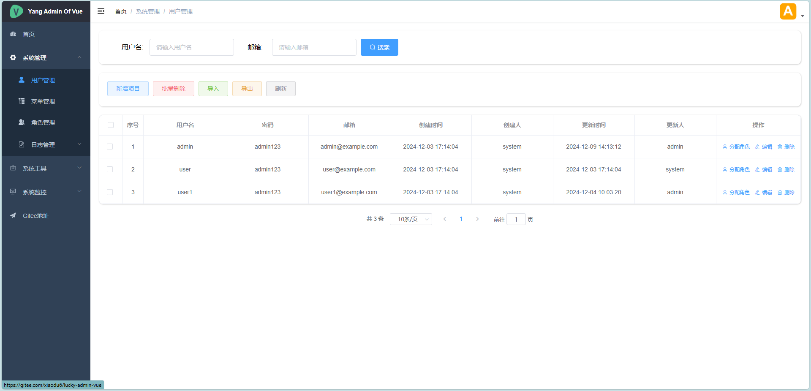
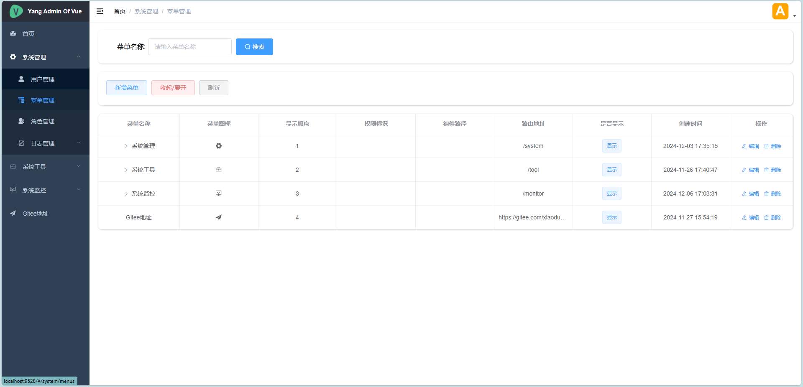
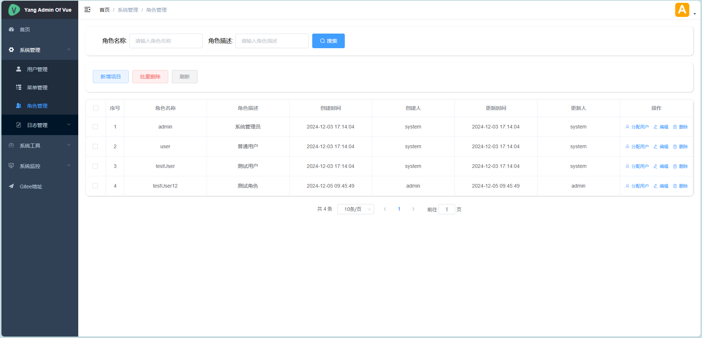
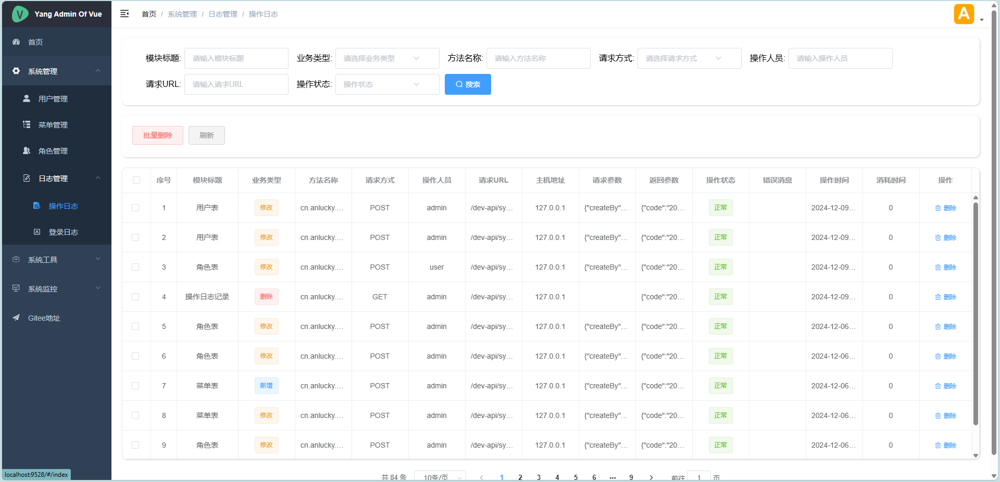
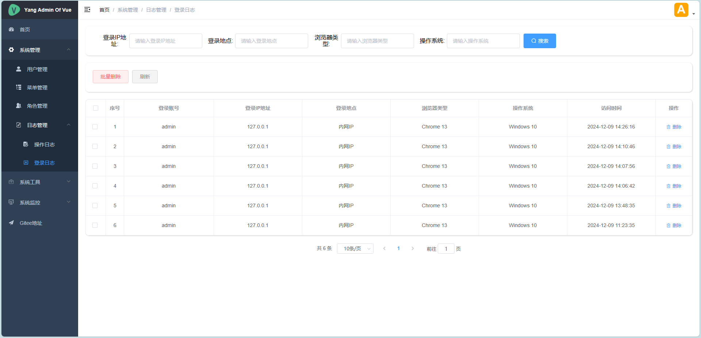

# Lucky-Admin-Vue

#### 介绍
Lucky-Admin-Vue 一个基于vue-admin-template的后台管理框架，集成了动态角色权限，动态路由，日志管理，Sa-Token权限校验，快速构建一个管理后台的框架
#### 软件架构
##### 开发环境
###### 后端
- JDK 1.8+
- SpringBoot 3
- MySQL 5.7+ 
- Maven 3.6+
###### 前端
- vue 2
- node.js 18.0+
##### 后端目录架构
```
src
├─system                # 系统相关
│  ├─annotation         # 注解相关
│  ├─aspectj            # 切面相关
│  ├─base               # 基础类
│  │  └─controller      # 继承前端控制器
│  ├─config             # 配置相关
│  ├─controller         # 前端控制器
│  │  ├─monitor         # 监控相关
│  │  └─system          # 系统相关
│  ├─enums              # 枚举相关
│  ├─exception          # 异常相关
│  ├─gen                # 代码生成相关
│  ├─listener           # 监听相关
│  ├─mapper             # mapper
│  ├─page               # 分页相关
│  │  └─vo              # 分页视图对象
│  ├─pojo               # 实体类
│  │  ├─monitor         # 监控相关实体类
│  │  │  └─server       # 服务器信息实体类
│  │  └─system          # 系统相关实体类
│  ├─service            # 服务相关
│  │  ├─monitor         # 监控相关服务
│  │  └─system          # 系统相关服务
│  │      └─impl        # 系统相关服务实现类
│  ├─utils              # 工具类
│  └─vo                 # 系统相关视图对象
└─vo                    # 全局相关视图对象
``` 
##### 前端目录架构
```
src
├─api                   # api接口
│  ├─monitor            # 监控相关api
│  └─system             # 系统相关api
├─assets                # 静态资源
│  ├─403_images         # 403图片
│  ├─404_images         # 404图片
│  ├─css                # 样式文件
│  └─icons              # 图标
│      └─svg            # svg图标
├─components            # 组件
│  ├─Breadcrumb         # 面包屑
│  ├─Hamburger          # 汉堡图标
│  ├─IconSelect         # 图标选择器
│  ├─ParentView         # 父级路由
│  └─SvgIcon            # svg图标
├─directive             # 自定义指令
│  └─permission         # 权限指令
├─icons                 # 图标
│  └─svg                # svg图标
├─layout                # 布局
│  ├─components         # 布局组件
│  │  └─Sidebar         # 侧边栏
│  └─mixin              # 布局混入
├─router                # 路由
├─store                 # 状态管理
│  └─modules            # 状态管理模块
├─styles                # 样式文件
├─utils                 # 工具类
└─views                 # 页面
    ├─dashboard         # 首页
    ├─login             # 登录
    ├─monitor           # 监控相关
    │  └─server         # 服务器信息
    └─system            # 系统相关
        ├─logs          # 日志相关
        │  ├─loginlog   # 登录日志
        │  └─operlog    # 操作日志
        ├─menus         # 菜单相关
        ├─roles         # 角色相关
        └─users         # 用户相关
```
#### 安装教程

1. 创建数据库
2. 导入SQL目录下的数据库文件创建表以及基础的数据
3. 修改前端 .env.production 文件中在生产环境中调用的API URL 
4. 打包前端项目 上传至服务器
5. 修改后端 application.yml 文件中(spring.profiles.active = prod)
6. 修改application-prod.yml文件中数据库配置
7. 打包后端项目 上传至服务器
8. 前端可配合Nginx进行反向代理

~~~ linux
    java -jar lucky-admin-vue.jar
~~~

##### 前端打包教程

1. 确认是否有node环境以及版本在18.0以上
2. 进入根目录执行 npm install 下载依赖包
3. 设置修改 .env.production 文件中的后端请求地址 
4. 执行 npm run dev 启动项目(确认是否可以正常运行)
5. 执行 npm run build:prod 打包线上环境项目(dir: dist)
6. 将 dist 目录中的文件上传至服务器

##### 后端打包教程

1. 确认是否有jdk环境以及版本在1.8以上执行
2. 修改application.yml文件中使用配置文件的配置(spring.profiles.active = prod)
3. 修改application-prod.yml文件中数据库配置
4. 执行 mvn clean package -Dmaven.test.skip=true 打包项目(dir: target)
5. 在target中找到项目名.jar包上传至服务器

#### 待完善功能

1. 系统工具-》系统接口-》未显示 Swargger 文档
2. 合适位置集成Redis
3. 集成定时任务功能
4. 代码生成工具可视化
5. 集成Excel导入导出
6. 集成图片上传下载
7. 增加用户头像修改、密码加密、登录逻辑优化
8. 待添加......

#### 项目截图





